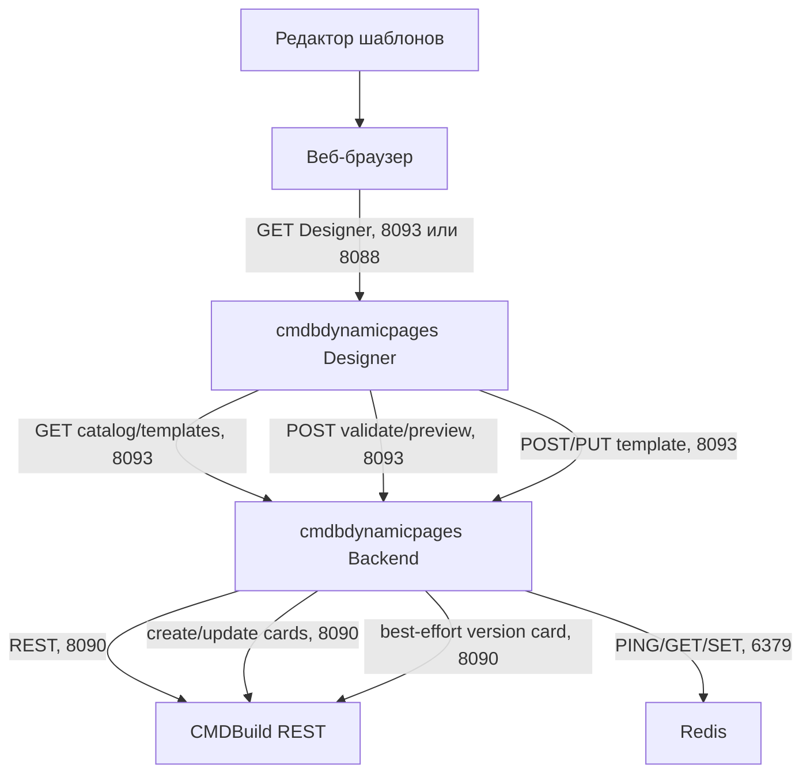
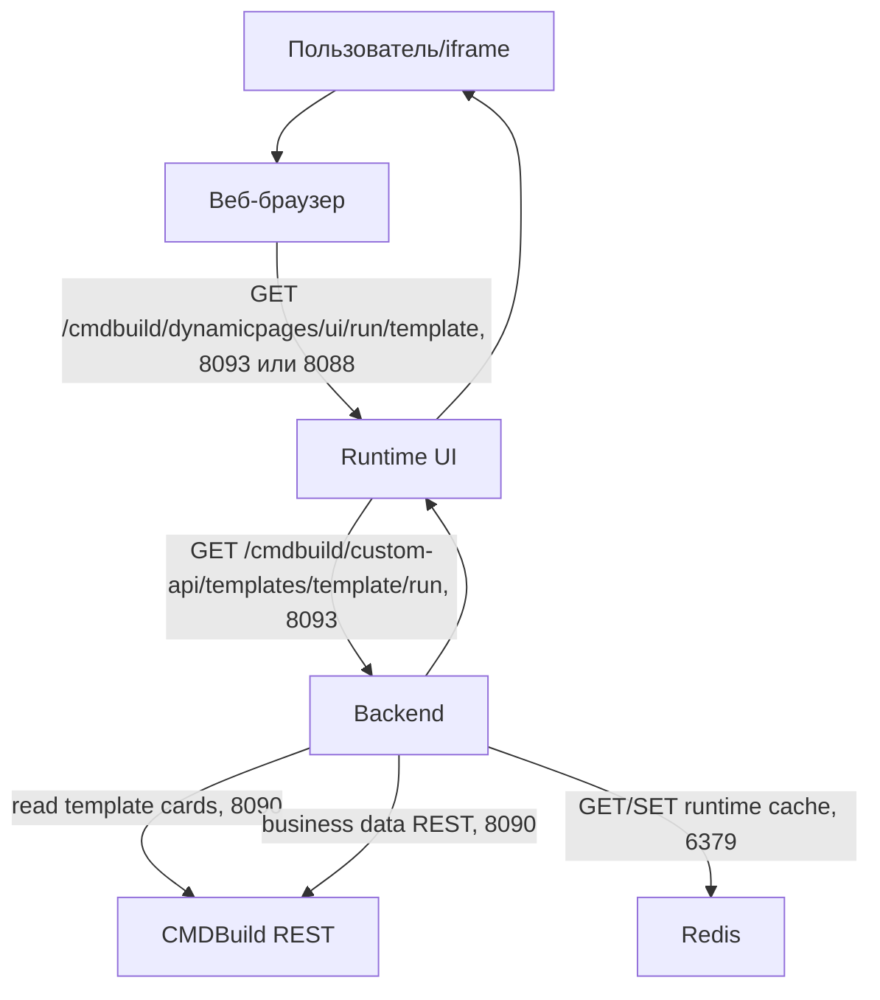
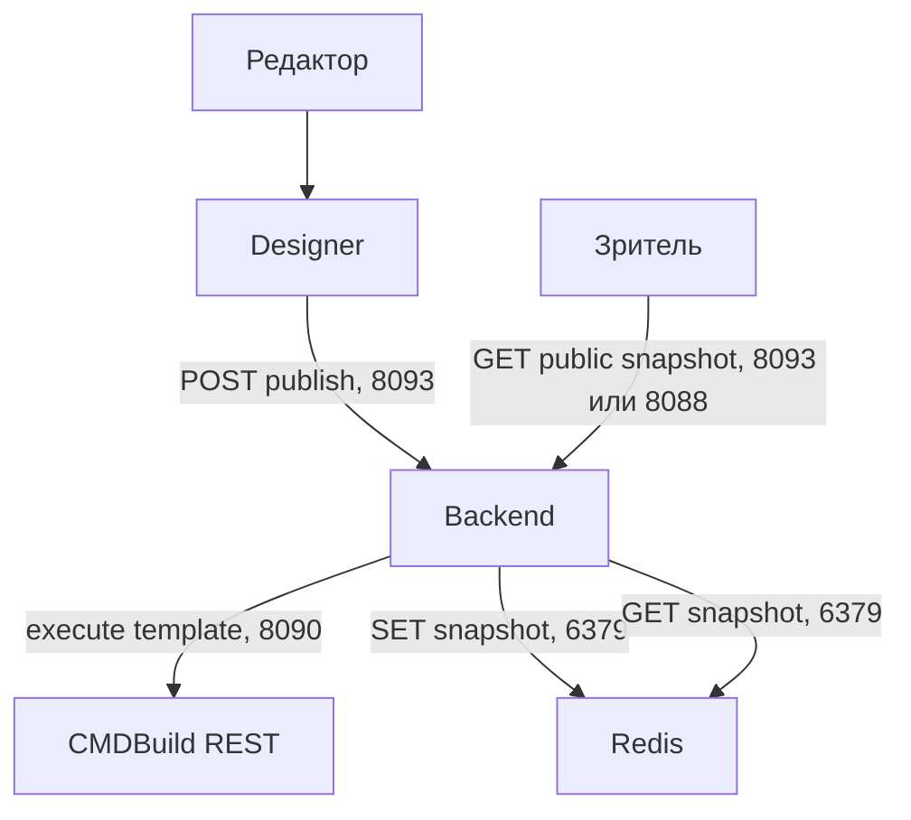
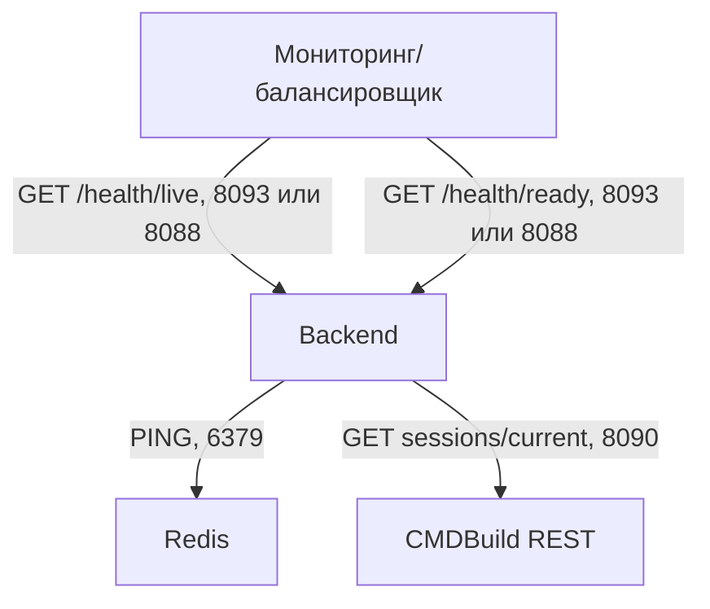
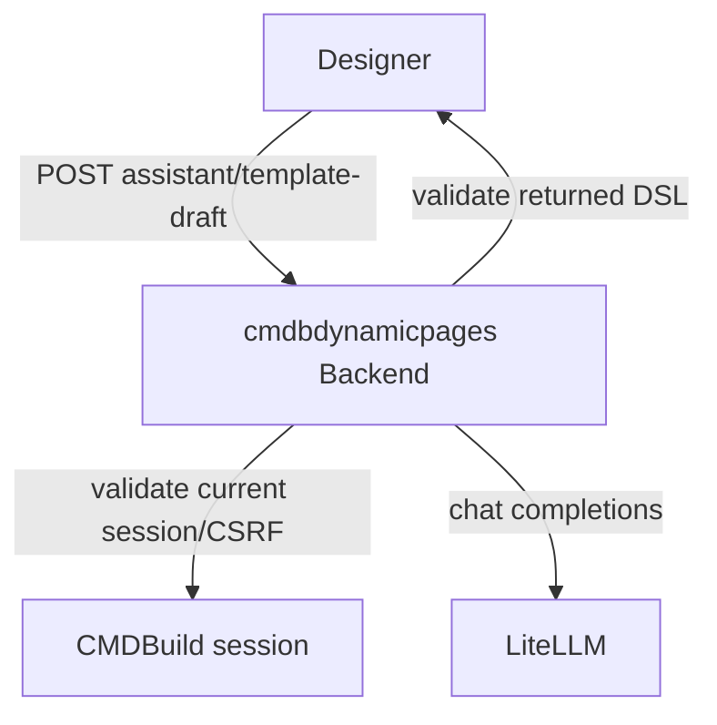

# Описание бизнес-процессов

## BP-001. Подготовка шаблона динамической страницы

Позитивный сценарий:

1. Редактор открывает Designer.
2. Designer загружает список шаблонов и каталог CMDBuild в рамках прав текущего пользователя.
3. Редактор задает входные переменные, выборки, сопоставление, итоговые данные, визуализацию и cache policy.
4. Preview выполняется через backend под текущей CMDBuild-сессией.
5. При сохранении backend пишет `Cst_QueryTemplate` и best-effort версию в `Cst_QueryTemplateVersion`.

Негативные сценарии:

- нет CMDBuild session cookie: backend возвращает 401;
- нет прав на технические классы: показывается permission denied text шаблона;
- CMDBuild REST недоступен на `8090`: preview/save завершается ошибкой backend;
- Redis недоступен: Designer продолжает работать, но readiness будет `503`, если Redis обязателен.

Логирование:

| Событие | Где фиксируется | Данные |
| --- | --- | --- |
| Загрузка launcher/custom page | `/cmdbuild/custom-api/client-log` | stage, href, timestamp |
| Proxy request к CMDBuild UI | `/cmdbuild/custom-api/proxy-log` | method, path, referer, userAgent |
| Preview шаблона | standard backend logs | requestId, template, user, status, rows |
| Save/update шаблона | `Cst_QueryTemplateVersion` best-effort | template, version, changedBy |

## BP-002. Запуск dynamic runtime страницы

Позитивный сценарий:

1. Пользователь открывает runtime URL или iframe.
2. Runtime UI вызывает read-only `GET run`.
3. Backend загружает шаблон, проверяет cache policy и права.
4. При cache hit возвращается готовый результат.
5. При cache miss backend выполняет DSL через CMDBuild REST и кладет результат в Redis.
6. Runtime UI отображает итоговую таблицу, sorting/filtering выполняются на клиенте.

Негативные сценарии:

- cookie CMDBuild не передан: dynamic runtime показывает сообщение о необходимости входа;
- недостаточно прав на business data или technical classes: возвращается permission denied text;
- Redis недоступен: при `CMDBDYNAMIC_HEALTH_REDIS_REQUIRED=true` readiness `503`, runtime может использовать memory fallback в dev;
- превышены лимиты строк/REST calls/traversal depth: backend возвращает ошибку выполнения.

Логирование:

| Событие | Где фиксируется | Данные |
| --- | --- | --- |
| GET runtime iframe | access/proxy logs окружения | URL без cookie/token |
| Direct `POST run` | standard backend logs | template, user, status, rows |
| Runtime `GET run` | standard backend logs | read-only iframe режим |
| Нет данных в правах пользователя | response JSON | HTTP 200, `success=true`, пустые `rows`, `emptyText` |
| Нет прав на используемый класс/атрибут | response JSON + backend stderr/container logs | HTTP 403, `success=false`, `permissionDenied=true`, `permissionDeniedText`; частичный результат по другим выборкам не отдается |
| Ошибка выполнения | response JSON + backend stderr/container logs | message/status; masked CMDBuild 404 может классифицироваться как generic execution error |

## BP-003. Публикация static snapshot

Позитивный сценарий:

1. Редактор включает `staticSnapshot`, подтверждает предупреждение и публикует snapshot.
2. Backend выполняет шаблон под сессией редактора.
3. Результат сохраняется в Redis без TTL.
4. Runtime отдает snapshot без проверки прав зрителя на исходные CMDBuild-объекты.

Негативные сценарии:

- предупреждение не принято: публикация запрещена;
- snapshot отсутствует в Redis: Runtime выводит `Страница отсутствует для загрузки`;
- Redis потерян без восстановления RDB: администратор/редактор должен опубликовать snapshot заново.

## BP-004. Health/readiness мониторинг

Позитивный сценарий:

1. Liveness проверяет, что backend process отвечает.
2. Readiness проверяет Redis и CMDBuild upstream.
3. Redis-only health позволяет отдельно видеть состояние Redis.

Негативные сценарии:

- Redis недоступен: `/health/redis` и `/health/ready` возвращают `503`;
- CMDBuild недоступен: `/health/ready` возвращает `503`;
- backend process недоступен: liveness не получает ответ.

## BP-005. Designer assistant draft

Позитивный сценарий:

1. Пользователь в Designer нажимает `Assistant draft` и описывает нужную таблицу или диаграмму.
2. Backend проверяет CMDBuild session cookie, same-origin headers и CSRF token.
3. Если `CMDP_ASSISTANT_ENABLED=false`, endpoint возвращает controlled disabled response.
4. Если assistant включен, backend отправляет краткий intent и текущий draft context в LiteLLM-compatible `/v1/chat/completions`.
5. Ответ модели парсится как JSON и валидируется тем же DSL validator, что обычный шаблон.
6. Designer применяет только валидный deterministic draft; runtime pages не вызывают LLM.

Негативные сценарии:

- нет CMDBuild session cookie или сессия истекла: endpoint отклоняется как обычный protected API;
- нет CSRF/same-origin для POST: endpoint отклоняется как state-changing вызов;
- LiteLLM key не настроен при включенном assistant: readiness/config validation показывает ошибку;
- модель вернула невалидный DSL: ответ не применяется в Designer.

Логирование:

| Событие | Где фиксируется | Данные |
| --- | --- | --- |
| Assistant draft request | structured logger `assistant.template_draft.*` | requestId, username/session hash, model, status/error |
| CSRF/same-origin отказ | backend logs | route, HTTP status; token не пишется |
