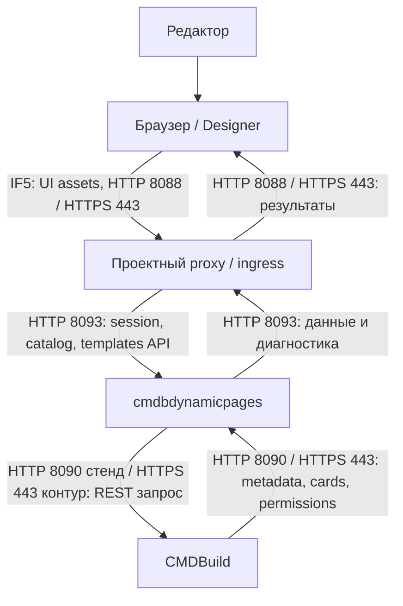
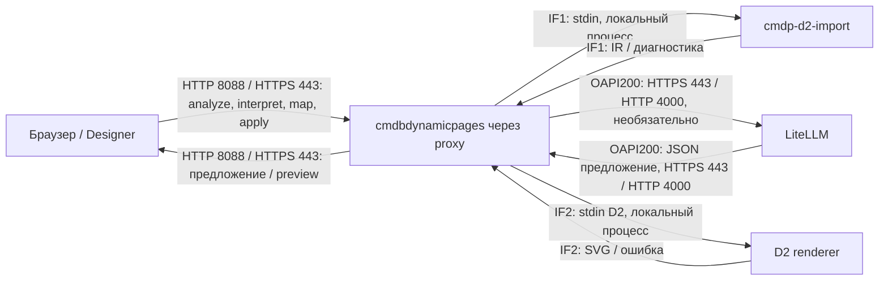
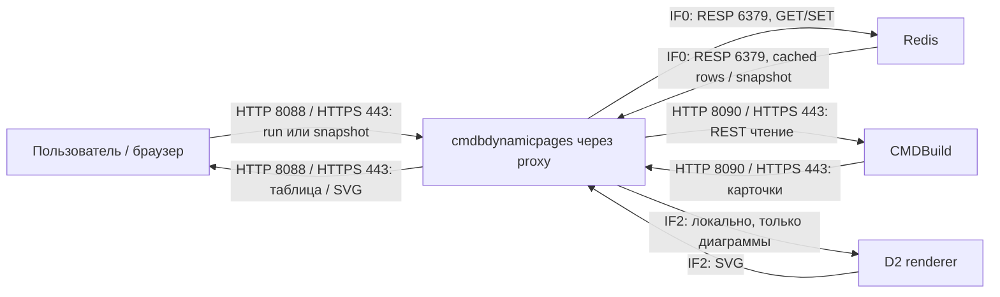

# Бизнес-процессы

Пользователь действует через браузер и Designer. Сохранённый алгоритм исполняется детерминированно; LLM — необязательный инструмент предложения конфигурации. HTTP-операции и flow IDs приведены в [реестре](information-model.md) и [OpenAPI](openapi.yaml).

## Подготовка и проверка данных

```mermaid
flowchart TD
  User[Редактор] --> Browser[Браузер / Designer]
  Browser -->|IF5: UI assets, HTTP 8088 / HTTPS 443| Front[Проектный proxy / ingress]
  Front -->|HTTP 8093: session, catalog, templates API| Backend[cmdbdynamicpages]
  Backend -->|HTTP 8090 стенд / HTTPS 443 контур: REST запрос| CMDB[CMDBuild]
  CMDB -->|HTTP 8090 / HTTPS 443: metadata, cards, permissions| Backend
  Backend -->|HTTP 8093: данные и диагностика| Front
  Front -->|HTTP 8088 / HTTPS 443: результаты| Browser
```

1. Авторизация: backend проверяет текущую CMDBuild-сессию и права; операции изменения дополнительно требуют same-origin и CSRF. Это общий подпроцесс сохранения, публикации и запросов Assistant.
2. Пользователь задаёт параметры и блоки данных вручную в редакторах или через Assistant. Каталог подтверждает классы, атрибуты и пути с учётом прав и настроенной глубины.
3. Необязательный Assistant подготавливает семантический план, затем Object Flow. Каждый ответ проверяется детерминированно; неоднозначности показываются пользователю, предложения применяются явно.
4. «Извлечение» выполняет выборки и сопоставления. Некорректное D2 mapping не блокирует проверку данных без диаграмм. «Итоговые данные» управляют представлением публикуемой таблицы.
5. Сохранение записывает конфигурацию в технические CMDBuild-классы; запись истории версий — best effort. Результат сохранения и ошибка записи версии различаются в логах.

Отказы: 401 без сессии; 403 без прав/CSRF; 409 при конфликте ревизий; ошибки детерминированной валидации; ограничение строк/REST-вызовов/времени. Отклонённый ответ модели не применяется. Регистрация: HTTP completion, `assistant.object_flow.*`, `template.*`, `template.execution_failed`, см. [карту событий](event-logging-map.md).

## D2: структура, данные и связи

```mermaid
flowchart LR
  U[Браузер / Designer] -->|HTTP 8088 / HTTPS 443: analyze, interpret, map, apply| API[cmdbdynamicpages через proxy]
  API -->|IF1: stdin, локальный процесс| Import[cmdp-d2-import]
  Import -->|IF1: IR / диагностика| API
  API -->|OAPI200: HTTPS 443 / HTTP 4000, необязательно| LLM[LiteLLM]
  LLM -->|OAPI200: JSON предложение, HTTPS 443 / HTTP 4000| API
  API -->|IF2: stdin D2, локальный процесс| D2[D2 renderer]
  D2 -->|IF2: SVG / ошибка| API
  API -->|HTTP 8088 / HTTPS 443: предложение / preview| U
```

1. Пользователь загружает D2. Анализатор извлекает роли, экземпляры, структуру и Notes без LLM.
2. «Интерпретировать структуру» предлагает семантику объектов/контейнеров; «Предложить маппинг» сопоставляет с подтверждёнными результатами Object Flow. Notes и prompt задают предметную логику, но не обходят проверку.
3. Пользователь явно применяет предложение либо редактирует mapping вручную: структуру, источники карточек, фильтры, подписи, иерархию и алгоритмы D2-связей.
4. Preview использует текущую конфигурацию и данные. Частичный preview сопровождается диагностикой пропущенных элементов; демонстрационные объекты D2 не подменяют отсутствующие данные.
5. Сохранение удерживает незавершённые правки. Публикация диаграммы требует исполнимого mapping; это не требование к отдельному извлечению или публикации таблицы.

Отказы: malformed D2, неподтверждённые ссылки, конфликт ревизий, timeout LiteLLM, неполный mapping и ошибка renderer. Для поддерживаемых staged Assistant-операций checkpoint/resume продолжает незавершённый этап. Регистрация: `assistant.diagram_mapping.*`, D2 import/render и HTTP completion. Prompts, карточки и ключи не включаются в операционные логи.

## Запуск и публикация

```mermaid
flowchart LR
  U[Пользователь / браузер] -->|HTTP 8088 / HTTPS 443: run или snapshot| API[cmdbdynamicpages через proxy]
  API -->|IF0: RESP 6379, GET/SET| Cache[Redis]
  Cache -->|IF0: RESP 6379, cached rows / snapshot| API
  API -->|HTTP 8090 / HTTPS 443: REST чтение| CMDB[CMDBuild]
  CMDB -->|HTTP 8090 / HTTPS 443: карточки| API
  API -->|IF2: локально, только диаграммы| D2[D2 renderer]
  D2 -->|IF2: SVG| API
  API -->|HTTP 8088 / HTTPS 443: таблица / SVG| U
```

- Динамический запуск проверяет сессию и права, использует cache policy; cache miss исполняет сохранённый алгоритм. LLM не вызывается.
- Публикация static snapshot требует явного подтверждения: данные извлекаются под сессией издателя, snapshot доступен без повторной проверки прав зрителя на исходные объекты. Redis хранит snapshot без TTL.
- Snapshot отсутствует/потерян: выдаётся состояние отсутствующей страницы, требуется повторная публикация. Ошибки доступа или выполнения не заменяются данными другого пользователя.
- Регистрация: `runtime.cache_result`, `snapshot.*`, `template.executed`, `template.execution_failed`. Исходные строки и секреты не логируются.

## Мониторинг и поддержка

Общий подпроцесс: `H0` liveness, `H1` Redis health, `H2` readiness, `M0` metrics. Readiness проверяет CMDBuild, Redis по политике обязательности, D2 renderer и importer; точные условия — [HealthCheck](healthcheck-map.md).

Операционные события идут в `L2` stdout/stderr. Дополнительный маршрут `L3` syslog или `L4` platform collector выбирается эксплуатацией. Диагностика `off` по умолчанию, `Basic` безопасна по составу полей, `Verbose` применяется временно с маскированием. Доставка проверяется отдельно от HTTP health. Для поддержки используются request ID, этап и безопасная причина; cookie, API key и бизнес-payload не копируются в обращения.
