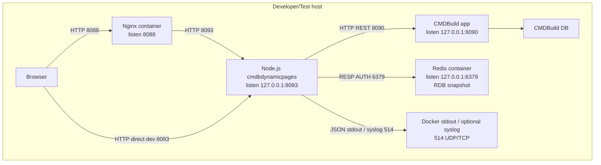
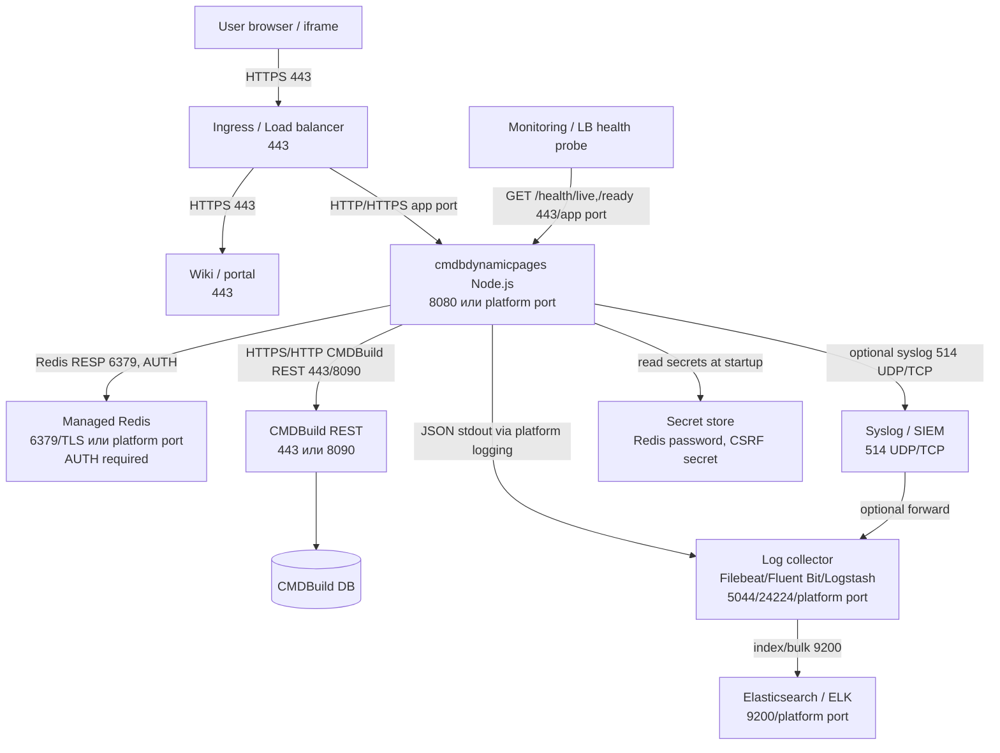

# Схема развертывания

Окружение разработки не требуется по `../aa.txt`, но локальные порты указаны как справочные, потому что текущая проверка выполняется локально. Для production схема ниже фиксирует те же logical nodes и сетевую связность.

## Тест ИТ / локальный стенд

## Бизнес Тест / Продуктив

Production deployment requirements:

- Redis password must be delivered as deployment secret, preferably file-mounted secret.
- `CMDBDYNAMIC_HEALTH_REDIS_REQUIRED=true`.
- Health endpoints must be exposed to LB/monitoring but do not require CMDBuild user cookies.
- CMDBuild session cookies must remain `HttpOnly`.
- Same-origin route for iframe should be provided by ingress/reverse proxy.

## Контуры

| Контур | Статус схемы | Отличия |
| --- | --- | --- |
| Тест ИТ | Описан | Локальные порты `8093`, `8090`, `6379`, `8088` |
| Бизнес Тест | Логически совпадает с production | Адреса/сертификаты задаются платформой |
| Продуктив | Описан | Redis password обязателен; health/readiness используются LB/monitoring |
