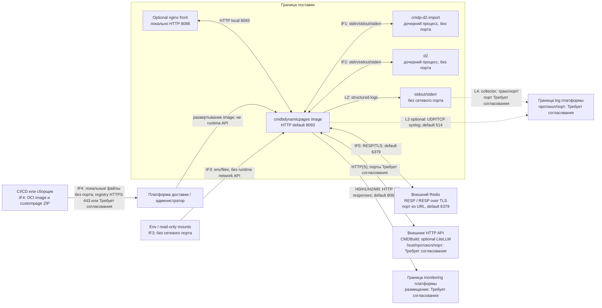
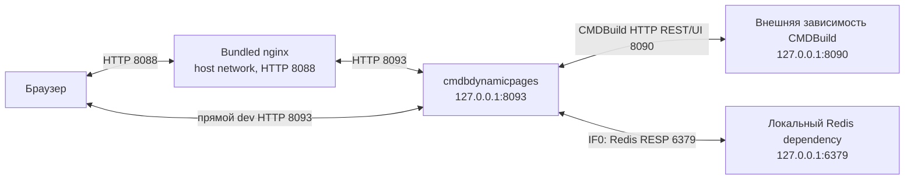

# Схема развертывания

Документ разделяет подтвержденный контракт поставки, справочный локальный стенд и не согласованные целевые контуры. Локальная проверка не является Test IT или Production acceptance. Runtime, конфигурация и внешние сервисы в рамках AA-remediation не изменяются.

## Граница поставки

Проект поставляет backend `cmdbdynamicpages`, D2 renderer/importer в его image и optional bundled nginx front. CMDBuild, Redis целевого контура, LiteLLM, secret store, PKI, monitoring и log platform являются внешними зависимостями. Их физическая topology, HA, storage и эксплуатация этим проектом не задаются. В локальном вспомогательном nginx Compose есть Redis, но это не определяет способ размещения production Redis.

```mermaid
flowchart LR
  Artifact["CI/CD или сборщик<br/>IF4: OCI image и custompage ZIP"]
  DeliveryPlatform["Платформа доставки / администратор"]
  Config["Env / read-only mounts<br/>IF3; без сетевого порта"]
  subgraph Delivery["Граница поставки"]
    Front["Optional nginx front<br/>локально HTTP 8088"]
    App["cmdbdynamicpages image<br/>HTTP default 8093"]
    Importer["cmdp-d2-import<br/>дочерний процесс, без порта"]
    Renderer["d2<br/>дочерний процесс, без порта"]
    Streams["stdout/stderr<br/>без сетевого порта"]
    Front <-->|"HTTP local 8093"| App
    App <-->|"IF1: stdin/stdout/stderr"| Importer
    App <-->|"IF2: stdin/stdout/stderr"| Renderer
    App -->|"L2: structured logs"| Streams
  end
  Artifact -->|"IF4: локальные файлы без порта; registry HTTPS 443 или Требует согласования"| DeliveryPlatform
  DeliveryPlatform -->|"развертывание image; не runtime API"| App
  Config -->|"IF3: env/files; без runtime network API"| App
  Redis["Внешний Redis<br/>RESP / RESP over TLS<br/>порт из URL, default 6379"]
  Upstream["Внешние HTTP API<br/>CMDBuild; optional LiteLLM<br/>host/протокол/порт: Требует согласования"]
  Ops["Граница monitoring платформы<br/>размещение: Требует согласования"]
  Logs["Граница log платформы<br/>протокол/порт: Требует согласования"]
  App <-->|"IF0: RESP/TLS; default 6379"| Redis
  App <-->|"HTTP(S); порты Требует согласования"| Upstream
  App -->|"H0/H1/H2/M0: HTTP responses; default 8093"| Ops
  Streams -.->|"L4: collector; транспорт/порт Требует согласования"| Logs
  App -.->|"L3 optional: UDP/TCP syslog; default 514"| Logs
```

Это схема границ интерфейсов, не утверждение о размещении на физических узлах. Для health/metrics стрелки показывают направление данных; запросы инициирует monitoring. HTTP API идентификаторы назначаются общим API-реестром, здесь они не угадываются. Сетевые порты за внешней границей требуют согласования, а не подстановки стандартной topology.

## Контракт image и runtime Compose

| Поверхность | Подтвержденный контракт |
| --- | --- |
| Image | Dockerfile запускает `sh scripts/container-entrypoint.sh`, затем `node scripts/dev-proxy-server.mjs`; финальный runtime использует `USER node` |
| Listener | Dockerfile задает `PROXY_HOST=127.0.0.1`, `PROXY_PORT=8093`, `EXPOSE 8093`; порт `8080` контрактом image не является |
| Orchestration | `docker-compose.runtime.yml` использует `network_mode: host`, `read_only: true`, tmpfs `/tmp`, restart `unless-stopped`; это конкретный поставляемый профиль, не требование ко всем платформам |
| Другой сетевой профиль | `PROXY_HOST`/`PROXY_PORT` конфигурируемы до старта; bridge/namespace routing, service DNS и публикация порта: Требует согласования. Loopback image-default сам по себе не доступен из другого container |
| Build artifacts IF4 | OCI image и custompage ZIP доставляются платформе/администратору. Image содержит `VERSION`, `BUILD_INFO.json`, `RUNTIME_SOURCE_MANIFEST.json`, runtime source, `/usr/local/bin/d2`, `/usr/local/bin/cmdp-d2-import`; build identity доступна через H0 и headers |
| Проверка поставки | `scripts/container-image.mjs verify` и `scripts/build-identity.mjs` проверяют manifest/build identity. Наличие кода verifier не доказывает CI/registry delivery конкретного image |
| Процессы IF1/IF2 | Importer и renderer запускаются backend через spawn со stdio, лимитами времени/размера; отдельных TCP listeners нет |
| Настройки IF3 | Deployment env и read-only secret/CA mounts; приложение не обращается к API secret store самостоятельно |
| Production preflight | Validator требует стабильный non-placeholder CSRF secret, корректный `CMDP_PUBLIC_ORIGIN`, stdout target и корректный заданный CA contract; при direct syslog проверяет его configuration |
| Readiness | H0 проверяет живой процесс; H2 проверяет CMDBuild, обязательность Redis по конфигурации, renderer при enabled и всегда importer; LiteLLM и external log sink в H2 не входят |
| Logging | `CMDP_LOG_TARGET=stdout`, `CMDP_DIAGNOSTIC_MODE=off`; Basic/Verbose включаются env; syslog overlay опционален; collector/logging driver базовым Compose не задается |
| Optional Assistant | Runtime Compose default `CMDP_ASSISTANT_ENABLED=false`; API key mount подставляет `/dev/null`, если host file не задан; отсутствие ключа не делает весь backend неготовым |
| CA | `CMDP_TLS_CA_FILE` при наличии переходит в `NODE_EXTRA_CA_CERTS`; без override сохраняется trust prepared base image; bundle также применяется Redis TLS |

Image не включает CMDBuild/Redis/LiteLLM server. Нельзя считать loopback адреса stand контрактом целевого контура. Для отдельных сервисов другой network namespace требуется deployment-owned адрес/порт, не host-IP discovery или правка исходников.

## Локальная разработка: справочная схема

Фиксированный контракт stand: `localhost:8088`, `127.0.0.1:8093`, `127.0.0.1:8090`, `127.0.0.1:6379`. Порты нельзя менять для обхода неисправности. Это договоренность локального запуска, не доказательство текущих listeners.

```mermaid
flowchart LR
  Browser["Браузер"]
  Nginx["Bundled nginx<br/>host network, HTTP 8088"]
  Backend["cmdbdynamicpages<br/>127.0.0.1:8093"]
  CMDB["Внешняя зависимость CMDBuild<br/>127.0.0.1:8090"]
  Redis["Локальный Redis dependency<br/>127.0.0.1:6379"]
  Browser <-->|"HTTP 8088"| Nginx
  Nginx <-->|"HTTP 8093"| Backend
  Browser <-->|"прямой dev HTTP 8093"| Backend
  Backend <-->|"CMDBuild HTTP REST/UI 8090"| CMDB
  Backend <-->|"IF0: Redis RESP 6379"| Redis
```

Bundled nginx восстанавливается только через `npm run nginx:dev` (`docker-compose.nginx.yml`). Этот Compose не запускает backend и CMDBuild. Его nginx healthcheck проверяет конфигурацию/master process, не upstream; Redis healthcheck делает `redis-cli ping`. Redis запускается с RDB `--save 60 1`, `--appendonly no` и volume `cmdbdynamicpages-redis-data`; AUTH в этом профиле не настраивается. Эти параметры не являются production-политикой retention/backup/security. Redis client URL с loopback не доказывает, что сам server привязан только к loopback.

Маршрут `/health/` проходит через local nginx `8088` к backend `8093`; `/metrics` им не опубликован и получает `404`. Для M0 используется backend address. Другие проекты и общий host nginx не входят в эту схему и не меняются.

## Test IT / Тест ИТ

Факт наличия и адреса этого контура: **Требует согласования**. Физическая схема не предоставлена; локальный stand не подставляется вместо Test IT.

| Поле | Значение |
| --- | --- |
| Узлы, платформа, replicas, image digest | Требует согласования |
| Backend bind/port и внешний browser origin | Требует согласования; default image `8093` не задает external URL |
| CMDBuild/Redis/LiteLLM endpoints, протоколы и порты | Требует согласования |
| Secret/CA mounts IF3, доступ и ротация | Требует согласования |
| H0/H1/H2/M0 collector, cadence и thresholds | Требует согласования |
| Внешний маршрут логов L3 либо L4 и evidence | Требует согласования |
| Владелец, acceptance window и backup/restore | Требует согласования |

Критерии будущей приемки: production-like preflight, identity image IF4, H0/H1/H2, согласованный сбор M0, проверка IF1/IF2 и утвержденный бизнес-сценарий. Выполнение здесь не заявляется.

## Business Test / Бизнес Тест

Факт наличия и отличия от Test IT: **Требует согласования**. Не утверждается совпадение topology с Production.

| Поле | Значение |
| --- | --- |
| Узлы, платформа, replicas, image digest | Требует согласования |
| Browser origin, same-origin routing, TLS termination и порты | Требует согласования |
| CMDBuild/Redis/LiteLLM endpoints, протоколы и порты | Требует согласования |
| Набор тестовых данных, пользовательские роли, cookie policy | Требует согласования |
| Secrets/CA IF3, владельцы и ротация | Требует согласования |
| Monitoring H0/H1/H2/M0, cadence, dashboards | Требует согласования |
| L3/L4, retention и подтверждение доставки | Требует согласования |
| Ответственный за бизнес-приемку и расписание | Требует согласования |

Приемка требует аутентифицированных пользовательских сценариев с согласованными правами и данными. Здоровый backend либо HTTP `401` upstream, принимаемый readiness как доступность, не заменяет эту проверку.

## Production / Продуктив

Адреса, инфраструктура и эксплуатационные решения: **Требует согласования**. Схема выше показывает только границу приложения; внешние ingress, collector, storage, PKI и HA не предписываются.

| Поле | Значение |
| --- | --- |
| Узлы, orchestration, replicas, resources, registry/image digest | Требует согласования |
| `CMDP_PUBLIC_ORIGIN`, backend bind/port, browser URL и TLS policy | Требует согласования |
| CMDBuild/Redis/LiteLLM endpoints, DNS, протоколы и порты | Требует согласования |
| Redis AUTH/ACL/TLS, persistence и backup/restore | Требует согласования; image/Compose сами эти политики не создают |
| Secrets/CA IF3, владельцы, ротация, аварийный отзыв | Требует согласования |
| H0 для self-check, H2 для readiness/routing, M0 collection | Контракты реализованы; probes, cadence, alerts, thresholds: Требует согласования |
| Внешний sink L3 либо L4, retention и end-to-end evidence | Требует согласования; без подтверждения открыт P0 blocker приемки |
| Rollout, rollback, restore, on-call и окно изменений | Требует согласования |

## Незакрытые приемочные условия

- Согласовать отдельные deployment-параметры и физическую схему каждого целевого контура; проверить доступность зависимостей из network namespace backend.
- Сравнить image/runtime build identity и доказать запуск именно нужного артефакта; локальная сборка не доказывает registry/CI delivery.
- Проверить H0 и H2 отдельно: image healthcheck использует только H0; отсутствие importer не обнаруживается liveness.
- Настроить и доказать хотя бы один внешний маршрут L3/L4. Это P0 logging gate, который нельзя закрыть описанием схемы.
- Устранить отдельным runtime изменением P0 diagnostic/security gap: `dynamic_ui.render_failed` логирует stack вне Verbose, а общий logger не очищает все произвольные поля. Документация не выдает это за выполненный baseline.
- Выполнить согласованные authenticated UI/D2/Assistant сценарии; в этой docs-only задаче runtime/restart/live smoke не запускались.

См. [HealthCheck](healthcheck-map.md), [метрики](metrics-map.md), [секреты и CA](secrets-map.md), [события](event-logging-map.md), [логирование](logging-flow.md).
