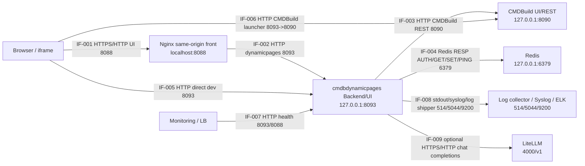

# Информационная модель

## Схема потоков

## Реестр информационных потоков

| ID | Источник | Получатель | Канал и порт | Данные | Примечание |
| --- | --- | --- | --- | --- | --- |
| IF-001 | Browser | Nginx | HTTP `localhost:8088` | `/cmdbuild/*`, `/health/*` | Project-only browser-facing origin; `/` returns `404` |
| IF-002 | Nginx | cmdbdynamicpages Backend | HTTP `127.0.0.1:8093` | Designer UI, Runtime UI, custom API, health | Reverse proxy path `/cmdbuild/*` и `/health/*` |
| IF-003 | cmdbdynamicpages Backend | CMDBuild REST | HTTP `127.0.0.1:8090` | Session, classes, domains, cards, relations, technical cards | Header `CMDBuild-Authorization`; cookie/token не логируются |
| IF-004 | cmdbdynamicpages Backend | Redis | RESP `127.0.0.1:6379` | Runtime cache, static snapshots, PING | Production Redis требует password/AUTH |
| IF-005 | Browser | cmdbdynamicpages Backend | HTTP `127.0.0.1:8093` | Direct dev Designer/Runtime/API | Локальный прямой доступ без nginx |
| IF-006 | Browser | CMDBuild UI через proxy chain | HTTP `127.0.0.1:8093` -> `8090` | CMDBuild UI assets, custom page launcher | Нужен для входа и получения session cookie |
| IF-007 | Monitoring/LB | cmdbdynamicpages Backend | HTTP `8093` или `8088` | `/health/live`, `/health/ready`, `/health/redis` JSON | Readiness возвращает `503` при Redis/CMDBuild проблемах |
| IF-008 | cmdbdynamicpages Backend | Log collector / Syslog / ELK | stdout без порта; syslog `514` UDP/TCP; collector `5044/24224`; Elasticsearch `9200` | Structured operational events | Прямого Elasticsearch output из приложения нет; secrets маскируются |
| IF-009 | cmdbdynamicpages Backend | LiteLLM endpoint | HTTPS/HTTP `/v1/chat/completions` | Designer assistant prompt, current draft context, generated template draft | Optional, disabled by default; API key comes from env/secret file and is not logged |

## Данные CMDBuild

Технические классы:

| Класс | Назначение |
| --- | --- |
| `Cst_QueryToolConfig` | Runtime/system settings |
| `Cst_QueryTemplate` | Шаблоны DSL |
| `Cst_QueryTemplateVersion` | Версии шаблонов |

Business data читаются из существующих CMDBuild классов через DSL (`selectCards`, `expandRelations`, matching). Состав полей ограничивается used-field dependency map: backend запрашивает только атрибуты, реально используемые фильтрами, сопоставлением, итоговыми данными или визуализацией.

Кэш каталога хранит metadata путей через `reference`/`domain`: имя домена, описание, кардинальность, направление, исходный и целевой класс. Эти данные используются в Designer для фильтрации выбора атрибутов по типу связи и не дают дополнительных прав на чтение CMDBuild.

Runtime final table может содержать `cellMeta` по ячейкам: источник выборки, source class, source card id, attribute, domain path и производные внутренние URL на карточки, участвовавшие в строке (`sourceURLВыборка1`, `sourceURLВыборка2`, `sourceURLSelection1` и т.п.). Эти metadata используются только для отображения ссылок в UI, не содержат cookie/token/Redis secret и не пишутся в операционные логи.

Runtime diagrams не добавляют runtime-классов в CMDBuild. `result.diagrams` хранится в DSL шаблона и строится из уже выбранных rows/aliases. Первый тип `topology` отдается как статический SVG в HTML runtime и как `diagrams[]` в JSON runtime.

Специальный шаблон `kind=cmdbBuildView` читает не business cards, а metadata модели CMDBuild: classes, class attributes, domains, domain attributes, lookup types и lookup values. Он выполняется тем же backend и тем же `CMDBuild-Authorization` текущего пользователя. Отдельная авторизация соседнего `../cmdbuild` приложения не используется. Protected-шаблон `CmdbBuildView` хранится в `Cst_QueryTemplate`, но удаление такого шаблона блокируется backend; для обычных DSL-шаблонов служебный флаг `protected` не является признаком защиты.

## Данные Redis

| Namespace | Данные | TTL |
| --- | --- | --- |
| Runtime result cache | Результат выполнения шаблона + cache metadata | `spec.cache.ttlSeconds`, default 8h |
| Static snapshot | Опубликованный результат шаблона | Без TTL |
| In-flight coordination | Защита от одновременной сборки одного результата | В памяти backend |

Redis credentials не передаются в ответы API. В health/status возвращается замаскированный URL.

## Синхронные API

HTTP API проекта описан в [openapi.yaml](openapi.yaml). CMDBuild REST используется как внешний API и в этот OpenAPI не включается, кроме указания потоков IF-004.
