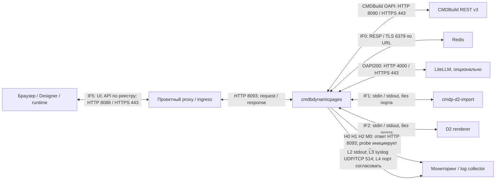

# Информационная модель

## Граница и направления

`cmdbdynamicpages` исполняет сохранённые выборки и D2 mapping без LLM. CMDBuild, Redis, LiteLLM и операционная платформа — внешние системы. D2 renderer и `cmdp-d2-import` — локальные процессы image, не отдельные сетевые сервисы.

В HTTP-реестре один ID обозначает одну операцию и её конкретные request/response объекты в OpenAPI. Направление данных указано для запроса **и** ответа, а не только как направление вызова. Readiness aliases относятся к одному health-каналу; несколько CRUD-операций не объединяются в один общий REST-поток. Redis допускает объединение данных проектного cache namespace в одном соединении с хранилищем.

Протокол и порт из deployment URL являются окончательными. Для стенда фиксированы HTTP `8088` front, HTTP `8093` backend, HTTP `8090` CMDBuild и RESP `6379` Redis. HTTPS `443` и HTTP `4000` LiteLLM ниже — документированные варианты, не назначение адресов заказчику. Любые иные порты, collector и контуры: Требует согласования.

## Обзор

```mermaid
flowchart LR
  Browser[Браузер / Designer / runtime]
  Front[Проектный proxy / ingress]
  Backend[cmdbdynamicpages]
  CMDB[CMDBuild REST v3]
  Redis[Redis]
  LLM[LiteLLM, опционально]
  Import[cmdp-d2-import]
  D2[D2 renderer]
  Ops[Мониторинг / log collector]
  Browser <-->|IF5: UI; API по реестру; HTTP 8088 / HTTPS 443| Front
  Front <-->|HTTP 8093; request / response| Backend
  Backend <-->|CMDBuild OAPI: HTTP 8090 / HTTPS 443| CMDB
  Backend <-->|IF0: RESP / TLS 6379 по URL| Redis
  Backend <-->|OAPI200: HTTP 4000 / HTTPS 443| LLM
  Backend <-->|IF1: stdin / stdout, без порта| Import
  Backend <-->|IF2: stdin / stdout, без порта| D2
  Backend -->|H0 H1 H2 M0: ответ HTTP 8093; probe инициирует Ops| Ops
  Backend -->|L2 stdout; L3 syslog UDP/TCP 514; L4 порт согласовать| Ops
```

[SVG той же обзорной модели](cmdbdynamicpages-environment-architecture.svg). Обзор группирует каналы для читаемости; реестр ниже содержит каждую HTTP-операцию отдельно.

## Реестр несетевых и инфраструктурных каналов

| ID | Источник | Получатель | Канал | Порт | Данные и направление | Защита / условия |
| --- | --- | --- | --- | --- | --- | --- |
| IF0 | cmdbdynamicpages | Redis | RESP, AUTH/PING/GET/SET/DEL | Default 6379, фактически из CMDBDYNAMIC_REDIS_URL | Backend -> команды, Redis -> cache/snapshot/статус; project namespace | Redis AUTH при настройке; TLS для rediss; без значений секретов |
| IF1 | cmdbdynamicpages | cmdp-d2-import | stdin/stdout/stderr, локальный процесс | Не сетевой | Backend -> D2 source/операция; importer -> IR/structure/ошибки | Ограничения времени, входа/выхода, элементов |
| IF2 | cmdbdynamicpages | D2 renderer | stdin/stdout/stderr, локальный процесс | Не сетевой | Backend -> построенный D2; renderer -> SVG/ошибка | Layout allowlist, ограничения ресурсов, обработка SVG |
| IF3 | Платформа доставки | cmdbdynamicpages | env / read-only file mount | Не сетевой | Конфигурация, secret references, CA -> память процесса | Не заявляет сетевой доступ к secret store; ротация по карте секретов |
| IF4 | CI/CD или сборщик | Платформа доставки / администратор | OCI image и custompage ZIP | Локальная сборка без порта; registry HTTPS 443 или Требует согласования | Проверенные артефакты и build identity -> deployment | Git revision, manifest; manual build имеет unverified-local provenance |
| IF5 | cmdbdynamicpages / CMDBuild UI | Браузер | HTML/JS/assets через same-origin front | Backend HTTP 8093, CMDBuild HTTP 8090; front HTTP 8088 / HTTPS 443 | UI/assets -> браузер; запросы за ресурсами в обратном направлении | CMDBuild UI proxy path allowlist; это не API чтения карточек |
| L2 | cmdbdynamicpages | stdout/stderr процесса | Structured JSON | Не сетевой | Операционные и diagnostic события -> контейнерная платформа | stdout обязателен; masking ограничения в карте событий |
| L3 | cmdbdynamicpages | Syslog collector | Direct syslog, UDP или TCP | Default 514, из CMDP_SYSLOG_PORT | Копия structured events -> sink | Опционально; адрес/протокол/доставка требуют подтверждения |
| L4 | Контейнерная платформа | Внешний log collector | Platform collector/agent/driver | Требует согласования | stdout/stderr -> операционное хранилище | Сбор настраивает платформа, end-to-end proof обязателен |

## Реестр HTTP-операций

Потоки OAPI с номерами от 0 — собственный API, от 100 — потребляемый CMDBuild, от 200 — LiteLLM. Пропуски номеров допустимы; опубликованные IDs не перенумеровывать ради сортировки. H/M/L имеют приоритет перед OAPI для специализированных health/metrics/logging каналов.

<!-- api-registry:start -->
| ID | Источник | Получатель | Канал | Порт | Данные и направление | Защита / условия |
| --- | --- | --- | --- | --- | --- | --- |
| H0 | cmdbdynamicpages | Мониторинг | `GET /health/live` `GET /cmdbuild/custom-api/health/live` | HTTP 8093 backend; front HTTP 8088 / HTTPS 443 | Проверка жизнеспособности; ответ backend -> мониторинг, запрос в обратном направлении | Без cookie; сетевой доступ согласовать |
| H1 | cmdbdynamicpages | Мониторинг | `GET /health/redis` `GET /cmdbuild/custom-api/health/redis` | HTTP 8093 backend; front HTTP 8088 / HTTPS 443 | Строгая проверка доступности Redis; ответ backend -> мониторинг, запрос в обратном направлении | Без cookie; сетевой доступ согласовать |
| H2 | cmdbdynamicpages | Мониторинг | `GET /health/ready` `GET /cmdbuild/custom-api/health/ready` | HTTP 8093 backend; front HTTP 8088 / HTTPS 443 | Проверка готовности к промышленной эксплуатации; ответ backend -> мониторинг, запрос в обратном направлении | Без cookie; сетевой доступ согласовать |
| M0 | cmdbdynamicpages | Мониторинг | `GET /metrics` | HTTP 8093; через front только при настройке | Метрики Prometheus; ответ backend -> мониторинг, запрос в обратном направлении | Без cookie; сетевой доступ согласовать |
| OAPI0 | Браузер / Designer / runtime | cmdbdynamicpages | `GET /cmdbuild/custom-api/cache/status` | HTTP 8093 backend; front HTTP 8088 / HTTPS 443 | Диагностическое состояние кэша; запрос Браузер / Designer / runtime -> cmdbdynamicpages, ответ обратно | Сессия/CSRF или явно публичный режим согласно OpenAPI |
| OAPI1 | Браузер / Designer / runtime | cmdbdynamicpages | `GET /cmdbuild/custom-api/logging/status` | HTTP 8093 backend; front HTTP 8088 / HTTPS 443 | Диагностическая конфигурация логирования; запрос Браузер / Designer / runtime -> cmdbdynamicpages, ответ обратно | Сессия/CSRF или явно публичный режим согласно OpenAPI |
| OAPI2 | Браузер / Designer / runtime | cmdbdynamicpages | `GET /cmdbuild/custom-api/session` | HTTP 8093 backend; front HTTP 8088 / HTTPS 443 | Текущая сессия CMDBuild; запрос Браузер / Designer / runtime -> cmdbdynamicpages, ответ обратно | Сессия/CSRF или явно публичный режим согласно OpenAPI |
| OAPI3 | Браузер / Designer / runtime | cmdbdynamicpages | `GET /cmdbuild/custom-api/model/catalog` | HTTP 8093 backend; front HTTP 8088 / HTTPS 443 | Каталог модели, доступный текущему пользователю; запрос Браузер / Designer / runtime -> cmdbdynamicpages, ответ обратно | Сессия/CSRF или явно публичный режим согласно OpenAPI |
| OAPI4 | Браузер / Designer / runtime | cmdbdynamicpages | `GET /cmdbuild/custom-api/model/classes` | HTTP 8093 backend; front HTTP 8088 / HTTPS 443 | Доступные классы CMDBuild; запрос Браузер / Designer / runtime -> cmdbdynamicpages, ответ обратно | Сессия/CSRF или явно публичный режим согласно OpenAPI |
| OAPI5 | Браузер / Designer / runtime | cmdbdynamicpages | `GET /cmdbuild/custom-api/model/classes/{className}` | HTTP 8093 backend; front HTTP 8088 / HTTPS 443 | Метаданные одного класса CMDBuild; запрос Браузер / Designer / runtime -> cmdbdynamicpages, ответ обратно | Сессия/CSRF или явно публичный режим согласно OpenAPI |
| OAPI6 | Браузер / Designer / runtime | cmdbdynamicpages | `GET /cmdbuild/custom-api/model/classes/{className}/attributes` | HTTP 8093 backend; front HTTP 8088 / HTTPS 443 | Доступные атрибуты одного класса; запрос Браузер / Designer / runtime -> cmdbdynamicpages, ответ обратно | Сессия/CSRF или явно публичный режим согласно OpenAPI |
| OAPI7 | Браузер / Designer / runtime | cmdbdynamicpages | `GET /cmdbuild/custom-api/model/domains` | HTTP 8093 backend; front HTTP 8088 / HTTPS 443 | Доступные домены CMDBuild; запрос Браузер / Designer / runtime -> cmdbdynamicpages, ответ обратно | Сессия/CSRF или явно публичный режим согласно OpenAPI |
| OAPI8 | Браузер / Designer / runtime | cmdbdynamicpages | `GET /cmdbuild/custom-api/auth/permission-scope` | HTTP 8093 backend; front HTTP 8088 / HTTPS 443 | Диагностика области действия разрешений; запрос Браузер / Designer / runtime -> cmdbdynamicpages, ответ обратно | Сессия/CSRF или явно публичный режим согласно OpenAPI |
| OAPI9 | Браузер / Designer / runtime | cmdbdynamicpages | `GET /cmdbuild/custom-api/csrf` | HTTP 8093 backend; front HTTP 8088 / HTTPS 443 | Получить CSRF-токен custom API; запрос Браузер / Designer / runtime -> cmdbdynamicpages, ответ обратно | Сессия/CSRF или явно публичный режим согласно OpenAPI |
| OAPI10 | Браузер / Designer / runtime | cmdbdynamicpages | `GET /cmdbuild/custom-api/schema` | HTTP 8093 backend; front HTTP 8088 / HTTPS 443 | Готовность технической схемы; запрос Браузер / Designer / runtime -> cmdbdynamicpages, ответ обратно | Сессия/CSRF или явно публичный режим согласно OpenAPI |
| OAPI11 | Браузер / Designer / runtime | cmdbdynamicpages | `GET /cmdbuild/custom-api/schema/parents` | HTTP 8093 backend; front HTTP 8088 / HTTPS 443 | Допустимые родительские суперклассы технической схемы; запрос Браузер / Designer / runtime -> cmdbdynamicpages, ответ обратно | Сессия/CSRF или явно публичный режим согласно OpenAPI |
| OAPI12 | Браузер / Designer / runtime | cmdbdynamicpages | `POST /cmdbuild/custom-api/schema/preview` | HTTP 8093 backend; front HTTP 8088 / HTTPS 443 | Предварительный просмотр создания технической схемы без разрушительных изменений; запрос Браузер / Designer / runtime -> cmdbdynamicpages, ответ обратно | Сессия/CSRF или явно публичный режим согласно OpenAPI |
| OAPI13 | Браузер / Designer / runtime | cmdbdynamicpages | `POST /cmdbuild/custom-api/schema/bootstrap` | HTTP 8093 backend; front HTTP 8088 / HTTPS 443 | Создать отсутствующие объекты технической схемы без разрушительных изменений; запрос Браузер / Designer / runtime -> cmdbdynamicpages, ответ обратно | Сессия/CSRF или явно публичный режим согласно OpenAPI |
| OAPI14 | Браузер / Designer / runtime | cmdbdynamicpages | `GET /cmdbuild/custom-api/config` | HTTP 8093 backend; front HTTP 8088 / HTTPS 443 | Конфигурация выполнения; запрос Браузер / Designer / runtime -> cmdbdynamicpages, ответ обратно | Сессия/CSRF или явно публичный режим согласно OpenAPI |
| OAPI15 | Браузер / Designer / runtime | cmdbdynamicpages | `PUT /cmdbuild/custom-api/config` | HTTP 8093 backend; front HTTP 8088 / HTTPS 443 | Создать или обновить конфигурацию выполнения; запрос Браузер / Designer / runtime -> cmdbdynamicpages, ответ обратно | Сессия/CSRF или явно публичный режим согласно OpenAPI |
| OAPI16 | Браузер / Designer / runtime | cmdbdynamicpages | `POST /cmdbuild/custom-api/assistant/object-flow/plan` | HTTP 8093 backend; front HTTP 8088 / HTTPS 443 | Предложить полный детерминированный Object Flow; запрос Браузер / Designer / runtime -> cmdbdynamicpages, ответ обратно | Сессия/CSRF или явно публичный режим согласно OpenAPI |
| OAPI17 | Браузер / Designer / runtime | cmdbdynamicpages | `POST /cmdbuild/custom-api/assistant/object-flow/semantic-plan` | HTTP 8093 backend; front HTTP 8088 / HTTPS 443 | Подготовить или продолжить семантический план именованных блоков Object Flow; запрос Браузер / Designer / runtime -> cmdbdynamicpages, ответ обратно | Сессия/CSRF или явно публичный режим согласно OpenAPI |
| OAPI18 | Браузер / Designer / runtime | cmdbdynamicpages | `POST /cmdbuild/custom-api/draft/object-flow/apply` | HTTP 8093 backend; front HTTP 8088 / HTTPS 443 | Применить проверенный Object Flow к черновику редактора; запрос Браузер / Designer / runtime -> cmdbdynamicpages, ответ обратно | Сессия/CSRF или явно публичный режим согласно OpenAPI |
| OAPI19 | Браузер / Designer / runtime | cmdbdynamicpages | `POST /cmdbuild/custom-api/mcp` | HTTP 8093 backend; front HTTP 8088 / HTTPS 443 | Endpoint CMDBuild MCP JSON-RPC только для чтения; запрос Браузер / Designer / runtime -> cmdbdynamicpages, ответ обратно | Сессия/CSRF или явно публичный режим согласно OpenAPI |
| OAPI20 | Браузер / Designer / runtime | cmdbdynamicpages | `GET /cmdbuild/custom-api/templates` | HTTP 8093 backend; front HTTP 8088 / HTTPS 443 | Перечислить шаблоны запросов; запрос Браузер / Designer / runtime -> cmdbdynamicpages, ответ обратно | Сессия/CSRF или явно публичный режим согласно OpenAPI |
| OAPI21 | Браузер / Designer / runtime | cmdbdynamicpages | `POST /cmdbuild/custom-api/templates` | HTTP 8093 backend; front HTTP 8088 / HTTPS 443 | Создать шаблон запроса; запрос Браузер / Designer / runtime -> cmdbdynamicpages, ответ обратно | Сессия/CSRF или явно публичный режим согласно OpenAPI |
| OAPI22 | Браузер / Designer / runtime | cmdbdynamicpages | `GET /cmdbuild/custom-api/templates/{code}` | HTTP 8093 backend; front HTTP 8088 / HTTPS 443 | Получить один шаблон; запрос Браузер / Designer / runtime -> cmdbdynamicpages, ответ обратно | Сессия/CSRF или явно публичный режим согласно OpenAPI |
| OAPI23 | Браузер / Designer / runtime | cmdbdynamicpages | `PUT /cmdbuild/custom-api/templates/{code}` | HTTP 8093 backend; front HTTP 8088 / HTTPS 443 | Обновить один шаблон; запрос Браузер / Designer / runtime -> cmdbdynamicpages, ответ обратно | Сессия/CSRF или явно публичный режим согласно OpenAPI |
| OAPI24 | Браузер / Designer / runtime | cmdbdynamicpages | `DELETE /cmdbuild/custom-api/templates/{code}` | HTTP 8093 backend; front HTTP 8088 / HTTPS 443 | Удалить один шаблон; запрос Браузер / Designer / runtime -> cmdbdynamicpages, ответ обратно | Сессия/CSRF или явно публичный режим согласно OpenAPI |
| OAPI25 | Браузер / Designer / runtime | cmdbdynamicpages | `GET /cmdbuild/custom-api/templates/{code}/versions` | HTTP 8093 backend; front HTTP 8088 / HTTPS 443 | Версии шаблона; запрос Браузер / Designer / runtime -> cmdbdynamicpages, ответ обратно | Сессия/CSRF или явно публичный режим согласно OpenAPI |
| OAPI26 | Браузер / Designer / runtime | cmdbdynamicpages | `POST /cmdbuild/custom-api/templates/{code}/validate` | HTTP 8093 backend; front HTTP 8088 / HTTPS 443 | Проверить сохранённый шаблон; запрос Браузер / Designer / runtime -> cmdbdynamicpages, ответ обратно | Сессия/CSRF или явно публичный режим согласно OpenAPI |
| OAPI27 | Браузер / Designer / runtime | cmdbdynamicpages | `POST /cmdbuild/custom-api/templates/{code}/preview` | HTTP 8093 backend; front HTTP 8088 / HTTPS 443 | Предварительный просмотр сохранённого шаблона; запрос Браузер / Designer / runtime -> cmdbdynamicpages, ответ обратно | Сессия/CSRF или явно публичный режим согласно OpenAPI |
| OAPI28 | Браузер / Designer / runtime | cmdbdynamicpages | `GET /cmdbuild/custom-api/templates/{code}/run` | HTTP 8093 backend; front HTTP 8088 / HTTPS 443 | Выполнение шаблона только для чтения; запрос Браузер / Designer / runtime -> cmdbdynamicpages, ответ обратно | Сессия/CSRF или явно публичный режим согласно OpenAPI |
| OAPI29 | Браузер / Designer / runtime | cmdbdynamicpages | `POST /cmdbuild/custom-api/templates/{code}/run` | HTTP 8093 backend; front HTTP 8088 / HTTPS 443 | Прямое выполнение шаблона; запрос Браузер / Designer / runtime -> cmdbdynamicpages, ответ обратно | Сессия/CSRF или явно публичный режим согласно OpenAPI |
| OAPI30 | Браузер / Designer / runtime | cmdbdynamicpages | `POST /cmdbuild/custom-api/templates/{code}/publish` | HTTP 8093 backend; front HTTP 8088 / HTTPS 443 | Опубликовать статический снимок в Redis; запрос Браузер / Designer / runtime -> cmdbdynamicpages, ответ обратно | Сессия/CSRF или явно публичный режим согласно OpenAPI |
| OAPI31 | Браузер / Designer / runtime | cmdbdynamicpages | `GET /cmdbuild/custom-api/public-snapshots/{code}/run` | HTTP 8093 backend; front HTTP 8088 / HTTPS 443 | Получить публичный статический снимок; запрос Браузер / Designer / runtime -> cmdbdynamicpages, ответ обратно | Сессия/CSRF или явно публичный режим согласно OpenAPI |
| OAPI32 | Браузер / Designer / runtime | cmdbdynamicpages | `POST /cmdbuild/custom-api/draft/validate` | HTTP 8093 backend; front HTTP 8088 / HTTPS 443 | Проверить несохранённый черновик; запрос Браузер / Designer / runtime -> cmdbdynamicpages, ответ обратно | Сессия/CSRF или явно публичный режим согласно OpenAPI |
| OAPI33 | Браузер / Designer / runtime | cmdbdynamicpages | `POST /cmdbuild/custom-api/draft/diagram-import/analyze` | HTTP 8093 backend; front HTTP 8088 / HTTPS 443 | Проанализировать автономный шаблон структуры D2; запрос Браузер / Designer / runtime -> cmdbdynamicpages, ответ обратно | Сессия/CSRF или явно публичный режим согласно OpenAPI |
| OAPI34 | Браузер / Designer / runtime | cmdbdynamicpages | `POST /cmdbuild/custom-api/draft/diagram-import/apply` | HTTP 8093 backend; front HTTP 8088 / HTTPS 443 | Применить проверенные сопоставления структуры D2 к черновику редактора; запрос Браузер / Designer / runtime -> cmdbdynamicpages, ответ обратно | Сессия/CSRF или явно публичный режим согласно OpenAPI |
| OAPI35 | Браузер / Designer / runtime | cmdbdynamicpages | `POST /cmdbuild/custom-api/assistant/diagram-import/interpret` | HTTP 8093 backend; front HTTP 8088 / HTTPS 443 | Предложить семантическую интерпретацию импортированных ролей D2; запрос Браузер / Designer / runtime -> cmdbdynamicpages, ответ обратно | Сессия/CSRF или явно публичный режим согласно OpenAPI |
| OAPI36 | Браузер / Designer / runtime | cmdbdynamicpages | `POST /cmdbuild/custom-api/assistant/diagram-import/map-selections` | HTTP 8093 backend; front HTTP 8088 / HTTPS 443 | Предложить поэтапные сопоставления размещения и топологии D2; запрос Браузер / Designer / runtime -> cmdbdynamicpages, ответ обратно | Сессия/CSRF или явно публичный режим согласно OpenAPI |
| OAPI37 | Браузер / Designer / runtime | cmdbdynamicpages | `POST /cmdbuild/custom-api/draft/preview` | HTTP 8093 backend; front HTTP 8088 / HTTPS 443 | Предварительный просмотр несохранённого черновика; запрос Браузер / Designer / runtime -> cmdbdynamicpages, ответ обратно | Сессия/CSRF или явно публичный режим согласно OpenAPI |
| OAPI38 | Браузер / Designer / runtime | cmdbdynamicpages | `POST /cmdbuild/custom-api/draft/diagram-import/restore` | HTTP 8093 backend; front HTTP 8088 / HTTPS 443 | Восстановить анализ D2 и сохранённое предложение Assistant; запрос Браузер / Designer / runtime -> cmdbdynamicpages, ответ обратно | Сессия/CSRF или явно публичный режим согласно OpenAPI |
| OAPI39 | Браузер / Designer / runtime | cmdbdynamicpages | `POST /cmdbuild/custom-api/draft/diagram-import/refresh` | HTTP 8093 backend; front HTTP 8088 / HTTPS 443 | Обновить D2 source без изменения применённой структуры mapping; запрос Браузер / Designer / runtime -> cmdbdynamicpages, ответ обратно | Сессия/CSRF или явно публичный режим согласно OpenAPI |
| OAPI40 | Браузер / Designer / runtime | cmdbdynamicpages | `GET /cmdbuild/custom-api/auth/capabilities` | HTTP 8093 backend; front HTTP 8088 / HTTPS 443 | Проверить доступность ролевых каталогов текущей сессии; запрос Браузер / Designer / runtime -> cmdbdynamicpages, ответ обратно | Сессия/CSRF или явно публичный режим согласно OpenAPI |
| L0 | Браузер / Designer / runtime | cmdbdynamicpages | `GET /cmdbuild/custom-api/client-log` `POST /cmdbuild/custom-api/client-log` | HTTP 8093 backend; front HTTP 8088 / HTTPS 443 | Прочитать журнал клиента либо добавить событие через query; запрос Браузер / Designer / runtime -> cmdbdynamicpages, ответ обратно | Cookie; CSRF для изменения; POST client-log отклоняется |
| L1 | Браузер / Designer / runtime | cmdbdynamicpages | `GET /cmdbuild/custom-api/proxy-log` | HTTP 8093 backend; front HTTP 8088 / HTTPS 443 | Прочитать либо очистить журнал proxy; запрос Браузер / Designer / runtime -> cmdbdynamicpages, ответ обратно | Cookie; CSRF для изменения; POST client-log отклоняется |
| OAPI41 | Браузер / Designer / runtime | cmdbdynamicpages | `GET /cmdbuild/custom-api/session-probe` | HTTP 8093 backend; front HTTP 8088 / HTTPS 443 | Диагностический alias текущей сессии; запрос Браузер / Designer / runtime -> cmdbdynamicpages, ответ обратно | Сессия/CSRF или явно публичный режим согласно OpenAPI |
| OAPI42 | Браузер / Designer / runtime | cmdbdynamicpages | `GET /cmdbuild/custom-api/model/domains/{domainName}` | HTTP 8093 backend; front HTTP 8088 / HTTPS 443 | Прочитать метаданные одного домена; запрос Браузер / Designer / runtime -> cmdbdynamicpages, ответ обратно | Сессия/CSRF или явно публичный режим согласно OpenAPI |
| OAPI43 | Браузер / Designer / runtime | cmdbdynamicpages | `GET /cmdbuild/custom-api/classes-probe` | HTTP 8093 backend; front HTTP 8088 / HTTPS 443 | Проверить чтение первой доступной CMDBuild class; запрос Браузер / Designer / runtime -> cmdbdynamicpages, ответ обратно | Сессия/CSRF или явно публичный режим согласно OpenAPI |
| OAPI44 | Браузер / Designer / runtime | cmdbdynamicpages | `GET /cmdbuild/dynamicpages/ui` | HTTP 8093 backend; front HTTP 8088 / HTTPS 443 | Перенаправить авторизованного пользователя в Designer; запрос Браузер / Designer / runtime -> cmdbdynamicpages, ответ обратно | Сессия/CSRF или явно публичный режим согласно OpenAPI |
| OAPI45 | Браузер / Designer / runtime | cmdbdynamicpages | `GET /cmdbuild/dynamicpages/ui/designer` | HTTP 8093 backend; front HTTP 8088 / HTTPS 443 | Открыть HTML оболочку Designer; запрос Браузер / Designer / runtime -> cmdbdynamicpages, ответ обратно | Сессия/CSRF или явно публичный режим согласно OpenAPI |
| OAPI46 | Браузер / Designer / runtime | cmdbdynamicpages | `GET /cmdbuild/dynamicpages/ui/designer/{section}` | HTTP 8093 backend; front HTTP 8088 / HTTPS 443 | Открыть раздел Designer по path; запрос Браузер / Designer / runtime -> cmdbdynamicpages, ответ обратно | Сессия/CSRF или явно публичный режим согласно OpenAPI |
| OAPI47 | Браузер / Designer / runtime | cmdbdynamicpages | `GET /cmdbuild/dynamicpages/ui/run/{code}` | HTTP 8093 backend; front HTTP 8088 / HTTPS 443 | Открыть runtime оболочку либо получить JSON результата; запрос Браузер / Designer / runtime -> cmdbdynamicpages, ответ обратно | Сессия/CSRF или явно публичный режим согласно OpenAPI |
| OAPI100 | cmdbdynamicpages | CMDBuild | `GET /sessions/current` | HTTP 8090 стенд / HTTPS 443 или CMDBUILD_ORIGIN | Прочитать текущую CMDBuild-сессию; запрос cmdbdynamicpages -> CMDBuild, ответ обратно | CMDBuild-Authorization; OAPI100 также unauth health probe |
| OAPI101 | cmdbdynamicpages | CMDBuild | `GET /classes` | HTTP 8090 стенд / HTTPS 443 или CMDBUILD_ORIGIN | Прочитать доступные классы и признаки CRUD; запрос cmdbdynamicpages -> CMDBuild, ответ обратно | CMDBuild-Authorization; OAPI100 также unauth health probe |
| OAPI102 | cmdbdynamicpages | CMDBuild | `POST /classes/` | HTTP 8090 стенд / HTTPS 443 или CMDBUILD_ORIGIN | Создать отсутствующий технический класс при bootstrap; запрос cmdbdynamicpages -> CMDBuild, ответ обратно | CMDBuild-Authorization; OAPI100 также unauth health probe |
| OAPI103 | cmdbdynamicpages | CMDBuild | `GET /classes/{className}` | HTTP 8090 стенд / HTTPS 443 или CMDBUILD_ORIGIN | Прочитать описание класса и проверить доступ к template class; запрос cmdbdynamicpages -> CMDBuild, ответ обратно | CMDBuild-Authorization; OAPI100 также unauth health probe |
| OAPI104 | cmdbdynamicpages | CMDBuild | `GET /classes/{className}/attributes` | HTTP 8090 стенд / HTTPS 443 или CMDBUILD_ORIGIN | Прочитать атрибуты класса; запрос cmdbdynamicpages -> CMDBuild, ответ обратно | CMDBuild-Authorization; OAPI100 также unauth health probe |
| OAPI105 | cmdbdynamicpages | CMDBuild | `POST /classes/{className}/attributes` | HTTP 8090 стенд / HTTPS 443 или CMDBUILD_ORIGIN | Создать отсутствующий технический атрибут; запрос cmdbdynamicpages -> CMDBuild, ответ обратно | CMDBuild-Authorization; OAPI100 также unauth health probe |
| OAPI106 | cmdbdynamicpages | CMDBuild | `GET /classes/{className}/attributes/{attributeName}` | HTTP 8090 стенд / HTTPS 443 или CMDBUILD_ORIGIN | Проверить существование и форму технического атрибута; запрос cmdbdynamicpages -> CMDBuild, ответ обратно | CMDBuild-Authorization; OAPI100 также unauth health probe |
| OAPI107 | cmdbdynamicpages | CMDBuild | `GET /domains` | HTTP 8090 стенд / HTTPS 443 или CMDBUILD_ORIGIN | Прочитать доступные домены для каталога и обхода связей; запрос cmdbdynamicpages -> CMDBuild, ответ обратно | CMDBuild-Authorization; OAPI100 также unauth health probe |
| OAPI108 | cmdbdynamicpages | CMDBuild | `GET /domains/{domainName}` | HTTP 8090 стенд / HTTPS 443 или CMDBUILD_ORIGIN | Прочитать стороны, cardinality и metadata домена; запрос cmdbdynamicpages -> CMDBuild, ответ обратно | CMDBuild-Authorization; OAPI100 также unauth health probe |
| OAPI109 | cmdbdynamicpages | CMDBuild | `GET /lookup_types` | HTTP 8090 стенд / HTTPS 443 или CMDBUILD_ORIGIN | Прочитать используемые типы lookup; запрос cmdbdynamicpages -> CMDBuild, ответ обратно | CMDBuild-Authorization; OAPI100 также unauth health probe |
| OAPI110 | cmdbdynamicpages | CMDBuild | `GET /roles` | HTTP 8090 стенд / HTTPS 443 или CMDBUILD_ORIGIN | Проверить доступность каталога ролей; запрос cmdbdynamicpages -> CMDBuild, ответ обратно | CMDBuild-Authorization; OAPI100 также unauth health probe |
| OAPI111 | cmdbdynamicpages | CMDBuild | `GET /roles/{roleName}` | HTTP 8090 стенд / HTTPS 443 или CMDBUILD_ORIGIN | Прочитать текущую роль и её привилегии; запрос cmdbdynamicpages -> CMDBuild, ответ обратно | CMDBuild-Authorization; OAPI100 также unauth health probe |
| OAPI112 | cmdbdynamicpages | CMDBuild | `GET /users` | HTTP 8090 стенд / HTTPS 443 или CMDBUILD_ORIGIN | Проверить доступность каталога пользователей; запрос cmdbdynamicpages -> CMDBuild, ответ обратно | CMDBuild-Authorization; OAPI100 также unauth health probe |
| OAPI113 | cmdbdynamicpages | CMDBuild | `GET /groups` | HTTP 8090 стенд / HTTPS 443 или CMDBUILD_ORIGIN | Проверить наличие и доступность endpoint groups; запрос cmdbdynamicpages -> CMDBuild, ответ обратно | CMDBuild-Authorization; OAPI100 также unauth health probe |
| OAPI114 | cmdbdynamicpages | CMDBuild | `GET /classes/{className}/cards` | HTTP 8090 стенд / HTTPS 443 или CMDBUILD_ORIGIN | Прочитать страницы бизнес-карточек или технические карточки; запрос cmdbdynamicpages -> CMDBuild, ответ обратно | CMDBuild-Authorization; OAPI100 также unauth health probe |
| OAPI115 | cmdbdynamicpages | CMDBuild | `POST /classes/{className}/cards` | HTTP 8090 стенд / HTTPS 443 или CMDBUILD_ORIGIN | Создать config, template либо template version карточку; запрос cmdbdynamicpages -> CMDBuild, ответ обратно | CMDBuild-Authorization; OAPI100 также unauth health probe |
| OAPI116 | cmdbdynamicpages | CMDBuild | `GET /classes/{className}/cards/{cardId}` | HTTP 8090 стенд / HTTPS 443 или CMDBUILD_ORIGIN | Прочитать одну карточку при runtime traversal; запрос cmdbdynamicpages -> CMDBuild, ответ обратно | CMDBuild-Authorization; OAPI100 также unauth health probe |
| OAPI117 | cmdbdynamicpages | CMDBuild | `PUT /classes/{className}/cards/{cardId}` | HTTP 8090 стенд / HTTPS 443 или CMDBUILD_ORIGIN | Обновить техническую config либо template карточку; запрос cmdbdynamicpages -> CMDBuild, ответ обратно | CMDBuild-Authorization; OAPI100 также unauth health probe |
| OAPI118 | cmdbdynamicpages | CMDBuild | `DELETE /classes/{className}/cards/{cardId}` | HTTP 8090 стенд / HTTPS 443 или CMDBUILD_ORIGIN | Удалить техническую template карточку; запрос cmdbdynamicpages -> CMDBuild, ответ обратно | CMDBuild-Authorization; OAPI100 также unauth health probe |
| OAPI119 | cmdbdynamicpages | CMDBuild | `GET /classes/{className}/cards/{cardId}/relations` | HTTP 8090 стенд / HTTPS 443 или CMDBUILD_ORIGIN | Прочитать связи карточки для ограниченного traversal; запрос cmdbdynamicpages -> CMDBuild, ответ обратно | CMDBuild-Authorization; OAPI100 также unauth health probe |
| OAPI120 | cmdbdynamicpages | CMDBuild | `GET /translations` | HTTP 8090 стенд / HTTPS 443 или CMDBUILD_ORIGIN | Прочитать переводы подписей для cmdb-build-view; запрос cmdbdynamicpages -> CMDBuild, ответ обратно | CMDBuild-Authorization; OAPI100 также unauth health probe |
| OAPI121 | cmdbdynamicpages | CMDBuild | `GET /domains/{domainName}/attributes` | HTTP 8090 стенд / HTTPS 443 или CMDBUILD_ORIGIN | Прочитать атрибуты домена для cmdb-build-view; запрос cmdbdynamicpages -> CMDBuild, ответ обратно | CMDBuild-Authorization; OAPI100 также unauth health probe |
| OAPI122 | cmdbdynamicpages | CMDBuild | `GET /lookup_types/{lookupName}/values` | HTTP 8090 стенд / HTTPS 443 или CMDBUILD_ORIGIN | Прочитать значения используемого lookup для cmdb-build-view; запрос cmdbdynamicpages -> CMDBuild, ответ обратно | CMDBuild-Authorization; OAPI100 также unauth health probe |
| OAPI200 | cmdbdynamicpages | LiteLLM | `POST /chat/completions` | HTTPS 443 / HTTP 4000 или LITELLM_BASE_URL | Получить текст типизированного authoring-предложения; запрос cmdbdynamicpages -> LiteLLM, ответ обратно | Серверный Bearer; разрешённый origin; только authoring |
<!-- api-registry:end -->

## Объекты данных и хранение

- Технические классы по умолчанию: `Cst_QueryToolConfig`, `Cst_QueryTemplate`, `Cst_QueryTemplateVersion` под `Cst_QueryTool`. Root/prefix управляются настройкой схемы. Чтение/создание классов, атрибутов и карточек — разные consumed API операции.
- Business cards читаются в рамках текущей CMDBuild-сессии. Reference/domain metadata подтверждают пути; configured depth не расширяет права. Итоговый результат содержит rows и metadata происхождения, без session token.
- DSL, конфигурация Assistant, D2 source, структура и mapping — часть шаблона. Предложения Assistant проходят детерминированную проверку, применение явно подтверждает пользователь. Карточки CMDBuild не создаются renderer.
- Preview без диаграмм исполняет данные независимо от готовности mapping. Частичный diagram preview сообщает об исключённых элементах; публикация диаграммы требует исполнимого контракта.
- Redis cache хранится по namespace и cache policy/TTL; static snapshots — без TTL. Координация in-flight и временные Assistant checkpoints находятся в backend-процессе, это не Redis queue.
- Snapshot опубликован под правами издателя и не перечитывает исходные карточки под правами зрителя; пользователь подтверждает этот режим отдельно.
- Специальный `cmdbBuildView` читает модель классов/атрибутов/domains/lookups, а не business cards, под текущей CMDBuild-сессией.

## Согласование источников

Собственный контракт: [OpenAPI](openapi.yaml). Внешние consumed-контракты: [CMDBuild](openapi/cmdbuild-consumed.openapi.yaml), [LiteLLM](openapi/litellm-consumed.openapi.yaml). Они описывают только реально используемое подмножество, не весь API поставщика.

Подтверждение доступности upstream H2 не доказывает права чтения/записи или успешную генерацию LLM. Health, metrics, secrets и logging-карты используют именно IDs этого реестра; значения окружения и реальные payload не публикуются.
