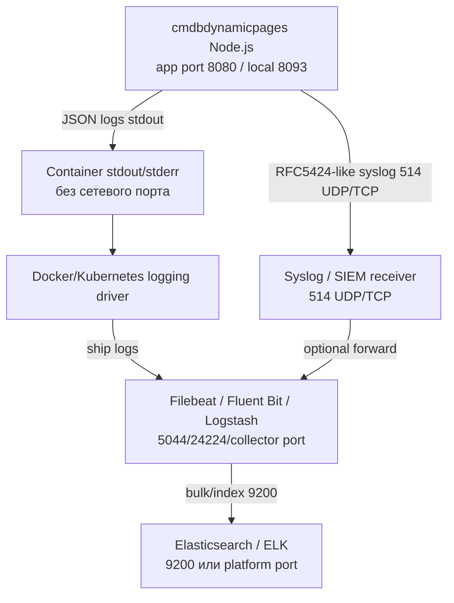

# Схема потоков логирования

Артефакт дополняет информационную модель и карту регистрации событий в части observability/ИБ потоков. Прямого соединения приложения с Elasticsearch нет: ELK подключается через внешний collector.

## Потоки



## Режимы

| Режим | Настройка | Назначение | Примечание ИБ |
| --- | --- | --- | --- |
| Docker stdout | `CMDP_LOG_TARGET=stdout` | Базовый режим для контейнеров | Collector отвечает за доставку в ELK |
| Syslog | `CMDP_LOG_TARGET=syslog` | VM/bare-metal, SIEM, существующий rsyslog/syslog-ng контур | UDP может терять сообщения; TCP предпочтительнее при строгих требованиях |
| Дублирование | `CMDP_LOG_TARGET=stdout,syslog` | Параллельная отправка в два контура | Следить за дублями в SIEM/ELK |

## Состав событий

- `http.request.finish` - завершение HTTP-запроса: method, path с маскированием query, statusCode, durationMs, requestId.
- `security.csrf_rejected` и `security.same_origin_rejected` - ИБ-отказы state-changing API.
- `redis.unavailable` и `redis.available` - изменение доступности Redis.
- `cmdbuild.request_failed` и `cmdbuild.request_error` - ошибки CMDBuild upstream.
- `runtime.cache_result` - cache hit/miss/refresh/join для runtime endpoint.
- `snapshot.published`, `snapshot.hit`, `snapshot.miss` - публикация и выдача static snapshot.
- `template.created`, `template.updated`, `template.deleted` и соответствующие `*_failed` - изменение шаблонов.

## Маскирование

По умолчанию маскируются:

```text
CMDP_LOG_REDACT_HEADERS=cookie,authorization,cmdbuild-authorization,x-csrf-token,x-cmdbdynamicpages-csrf,set-cookie
CMDP_LOG_REDACT_QUERY=password,passwd,pwd,token,secret,authorization,auth,csrf,x-cmdbdynamicpages-csrf
```

В операционные логи не пишутся:

- `CMDBuild-Authorization` cookie;
- `Authorization` headers;
- CSRF token;
- Redis password;
- runtime table rows;
- raw payload карточек CMDBuild.

## Диагностика

`GET /cmdbuild/custom-api/logging/status` возвращает активный target, level, format и списки маскирования без секретов. Endpoint диагностический и не должен использоваться как readiness.
