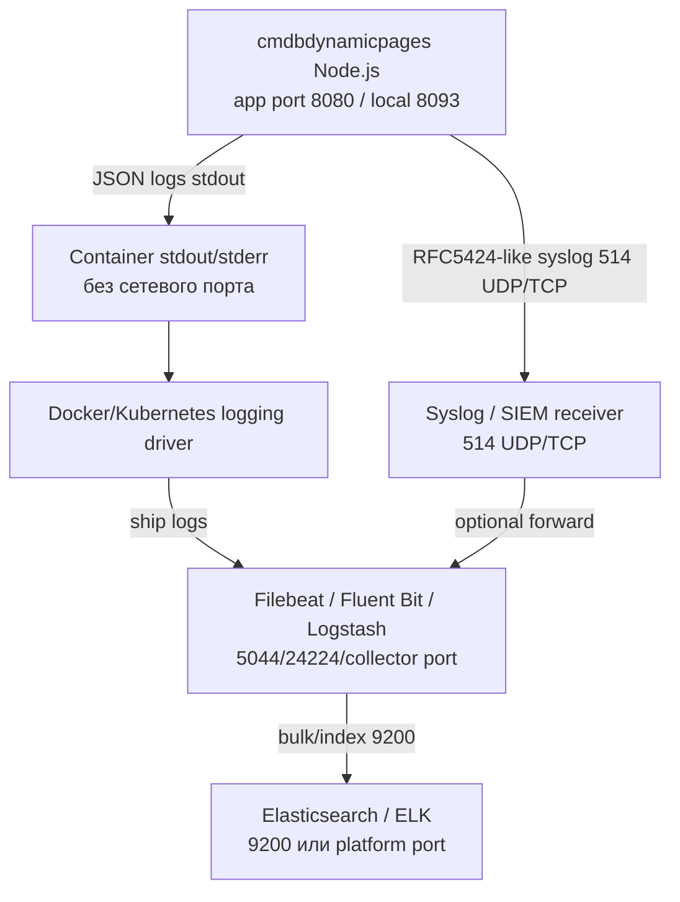

# Схема потоков логирования

Артефакт дополняет информационную модель и карту регистрации событий в части observability/ИБ потоков. Прямого соединения приложения с Elasticsearch нет: ELK подключается через внешний collector.

## Потоки



## Режимы

| Режим | Настройка | Назначение | Примечание ИБ |
| --- | --- | --- | --- |
| Stdout-first delivery | `CMDP_LOG_TARGET=stdout` | Local и production; platform collector, agent или sidecar забирает stdout/stderr | Base Compose не задаёт collector или Docker logging driver |
| Optional direct syslog | `CMDP_LOG_TARGET=stdout,syslog` через `docker-compose.syslog.yml` | VM/SIEM или существующий rsyslog/syslog-ng контур | `CMDP_SYSLOG_HOST` обязателен; UDP может терять сообщения, TCP предпочтительнее при строгих требованиях |

## Состав событий

- `http.request.finish` - завершение HTTP-запроса: method, path с маскированием query, statusCode, durationMs, requestId.
- `security.csrf_rejected` и `security.same_origin_rejected` - ИБ-отказы state-changing API.
- `redis.unavailable` и `redis.available` - изменение доступности Redis.
- `cmdbuild.request_failed` и `cmdbuild.request_error` - ошибки CMDBuild upstream.
- `runtime.cache_result` - cache hit/miss/refresh/join для runtime endpoint.
- `snapshot.published`, `snapshot.hit`, `snapshot.miss` - публикация и выдача static snapshot.
- `template.created`, `template.updated`, `template.deleted` и соответствующие `*_failed` - изменение шаблонов.
- `diagnostic.*` - opt-in diagnostic events при `CMDP_DIAGNOSTIC_MODE=Basic|Verbose`.

## Маскирование

По умолчанию маскируются:

```text
CMDP_LOG_REDACT_HEADERS=cookie,authorization,cmdbuild-authorization,x-csrf-token,x-cmdbdynamicpages-csrf,set-cookie
CMDP_LOG_REDACT_QUERY=password,passwd,pwd,token,secret,authorization,auth,csrf,x-cmdbdynamicpages-csrf
```

В операционные логи не пишутся:

- `CMDBuild-Authorization` cookie;
- `Authorization` headers;
- CSRF token;
- Redis password;
- runtime table rows;
- raw payload карточек CMDBuild.

## Диагностика

`GET /cmdbuild/custom-api/logging/status` возвращает активный target, level, format и списки маскирования без секретов. Endpoint диагностический и не должен использоваться как readiness.

Для stdout-first delivery acceptance требует external evidence: `scripts/verify-platform-log-route.sh <health-url> -- <platform collector query>`. Скрипт посылает уникальный `X-Request-ID`; platform query получает его через `CMDP_LOG_PROBE_ID` и завершается успешно только после подтверждения доставки.

`CMDP_DIAGNOSTIC_MODE=off` по умолчанию. `Basic` пишет безопасные diagnostic events без sensitive payload. `Verbose` добавляет sanitized HTTP и CMDBuild upstream diagnostics без request/response bodies, runtime rows, cookies, tokens, Redis password и raw CMDBuild payload; включать только временно.
