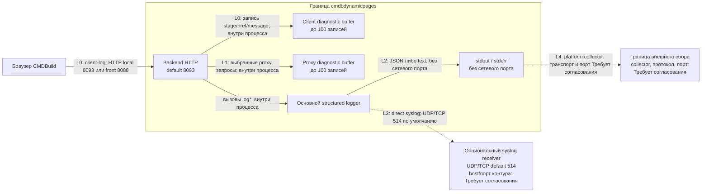

# Схема потоков логирования

Граница поставки: `cmdbdynamicpages` и его optional nginx front. Приложение пишет structured logs в stdout/stderr; direct syslog является дополнительной конфигурацией. Топология внешней платформы, ее продукты, узлы и соединения не предписываются.

## Потоки и граница платформы


```mermaid
flowchart LR
  Browser["Браузер CMDBuild"]
  subgraph Product["Граница cmdbdynamicpages"]
    App["Backend HTTP<br/>default 8093"]
    Client["Client diagnostic buffer<br/>до 100 записей"]
    Proxy["Proxy diagnostic buffer<br/>до 100 записей"]
    Logger["Основной structured logger"]
    Streams["stdout / stderr<br/>без сетевого порта"]
    App -->|"вызовы log*; внутри процесса"| Logger
    App -->|"L1: выбранные proxy запросы; внутри процесса"| Proxy
    Logger -->|"L2: JSON либо text; без сетевого порта"| Streams
  end
  Browser -->|"L0: client-log; HTTP local 8093 или front 8088"| App
  App -->|"L0: запись stage/href/message; внутри процесса"| Client
  Platform["Граница внешнего сбора<br/>collector, протокол, порт:<br/>Требует согласования"]
  Syslog["Опциональный syslog receiver<br/>UDP/TCP default 514<br/>host/порт контура: Требует согласования"]
  Streams -.->|"L4: platform collector; транспорт и порт Требует согласования"| Platform
  Logger -.->|"L3: direct syslog; UDP/TCP 514 по умолчанию"| Syslog
```

Пунктир означает условный маршрут, не подтвержденную установку. L0/L1 не являются отдельными внешними sinks и не пересылаются автоматически как buffers. L1 не обозначает nginx access log. Детали nginx logging платформы: Требует согласования. Ответы чтения диагностических endpoints и остальные HTTP API описываются API-реестром; здесь их идентификаторы не назначаются.

## Конфигурация основного pipeline

| Параметр | Default | Подтвержденная семантика |
| --- | --- | --- |
| `CMDP_LOG_TARGET` | `stdout` | normalizeLogTargets всегда добавляет stdout, в том числе для значения syslog; validator дополнительно проверяет итоговый набор |
| `CMDP_LOG_FORMAT` | `json` | Поддерживается также `text`; syslog содержит JSON независимо от console format |
| `CMDP_LOG_LEVEL` | `info` | `debug`, `info`, `warn`, `error`; фильтрует обычные события |
| `CMDP_DIAGNOSTIC_MODE` | `off` | Независимое включение дополнительных `diagnostic.*` событий |
| `CMDP_SYSLOG_HOST` | Код: `127.0.0.1`; overlay требует явное значение | Для production validator проверяет настроенный непустой/non-placeholder host; receiver не разворачивается приложением |
| `CMDP_SYSLOG_PORT` | `514` | Порт direct receiver; значение контура: Требует согласования |
| `CMDP_SYSLOG_PROTOCOL` | `udp` | `udp` или `tcp`, без TLS; политика транспорта: Требует согласования |
| `CMDP_SYSLOG_FACILITY` | `local0` | Facility RFC5424-like сообщения |

`writeStructuredLog` отправляет `error` в stderr, прочие уровни в stdout. `logging.syslog_failed` непосредственно пишет JSON warning в stderr, не повторяет неудачную отправку через syslog. UDP может терять сообщения; TCP-соединение создается на отправку с timeout 1000 ms. Durable queue, повторная доставка и подтверждение сохранения receiver не реализованы; TCP не дает гарантии аудита.

`docker-compose.runtime.yml` не содержит logging driver или collector topology. `docker-compose.syslog.yml` является явным optional overlay: `CMDP_LOG_TARGET=stdout,syslog`, обязательный `CMDP_SYSLOG_HOST`. Базовую поставку нельзя считать подключенной к внешней системе только по наличию этого файла. Прямого Elasticsearch output из приложения нет.

## Диагностические режимы

| Режим | Что добавляет | Ограничения |
| --- | --- | --- |
| `off` | Дополнительных diagnostic events нет | Обычный operational pipeline продолжает работать; это не отключение всех логов |
| `Basic` | `diagnostic.app.config_valid`, HTTP/CMDBuild finish metadata, распознанные UI performance measurements | Нет добавления request/response bodies этими diagnostic call sites |
| `Verbose` | Basic и sanitized HTTP/CMDBuild start/detail: headers, размеры тел, content type | Только временно для инцидента; production validator выдает warning, но не выключает режим автоматически |

Diagnostic events проходят через тот же `writeStructuredLog` на `info` с `force=true`: `CMDP_LOG_LEVEL=warn/error` их не подавляет. Настройки задаются до старта процесса, без изменения кода; смена env требует restart/recreate. Процедура включения, длительность окна и ответственный: Требует согласования.

## Маскирование и ограничения

Default списки:

```text
CMDP_LOG_REDACT_HEADERS=cookie,authorization,cmdbuild-authorization,x-csrf-token,x-cmdbdynamicpages-csrf,set-cookie
CMDP_LOG_REDACT_QUERY=password,passwd,pwd,token,secret,authorization,auth,csrf,x-cmdbdynamicpages-csrf
```

`sanitizeRequestPath` маскирует query по именам; `sanitizeUrlForLog` убирает URL userinfo/fragment и обрабатывает query; `sanitizeHeaders` маскирует перечисленные headers и обрабатывает referer. Это не универсальное распознавание секретов или персональных данных. Config override заменяет списки: обязательные чувствительные имена нельзя терять.

Полные строки результата/HTTP bodies не добавляются перечисленными diagnostic handlers. При этом в operational events встречаются username, templateCode, свободные exception messages, а client stage/message только ограничиваются по длине. `dynamic_ui.render_failed` пишет stack вне режима Verbose. Поэтому утверждение «все логи полностью очищены» неверно: **P0 blocker runtime-готовности** для этой диагностической ветки остается открытым. Исправление кода и его тесты не входят в текущую AA-remediation.

## Приемка внешней доставки

`GET /cmdbuild/custom-api/logging/status` требует CMDBuild cookie и показывает configuration summary, включая targets, level, format, diagnostic mode, redaction names и syslog settings. HTTP backend default `8093`, local front `8088`; внешний адрес/порт: Требует согласования. Endpoint не проверяет доступность collector и не является readiness.

Проверочный инструмент: `scripts/verify-platform-log-route.sh <health-url> -- <platform-query-command>`. Он посылает H0 с уникальным `X-Request-ID`; команда платформы получает ID в `CMDP_LOG_PROBE_ID` и должна завершиться с кодом `0` только после фактического нахождения события. Пользовательские команды, credentials, topology и результаты платформы не предполагаются из исходников.

До настройки и доказанного приема L3 либо L4 остается **P0 blocker эксплуатационной приемки**. В этой задаче live receiver не проверялся. Контуры, владельцы, retention, cadence, правила ИБ и адреса/порты платформы: Требует согласования.
